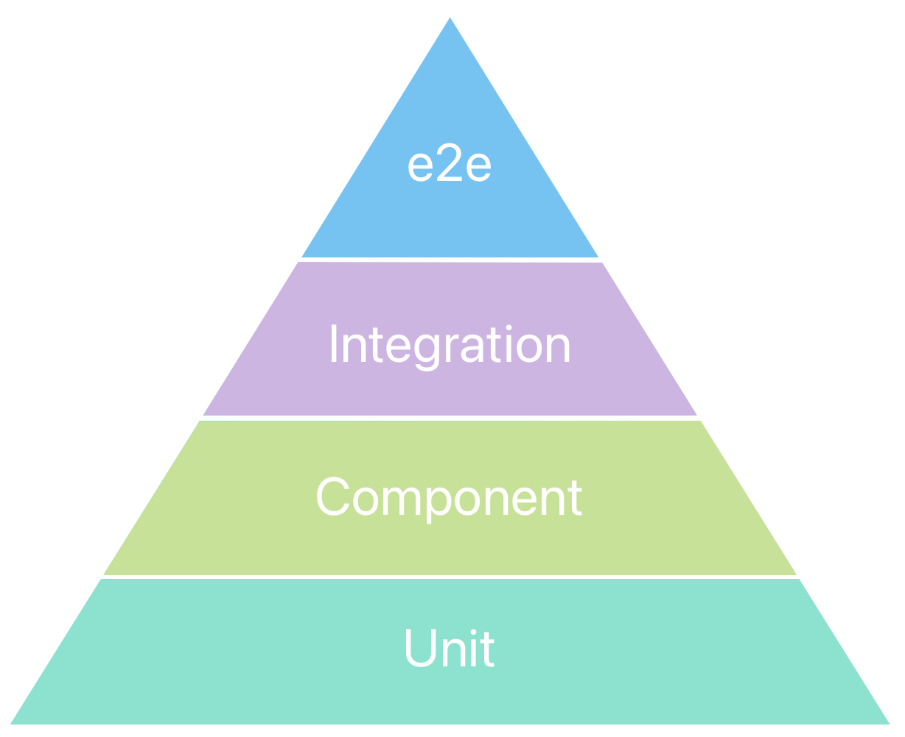

# Теория тестирования

## Что такое тестирование

Тестирование программного обеспечения — это процесс оценки и проверки, что программное приложение или система функционирует правильно, соответствует требованиям и удовлетворяет потребности пользователей. Тестирование помогает выявить дефекты, ошибки или несоответствия в программном обеспечении, чтобы они могли быть исправлены до выпуска продукта в эксплуатацию.

## Цели тестирования - зачем тестировать

1. **Выявление дефектов**: Основная цель тестирования — найти и исправить ошибки в программном обеспечении.
2. **Проверка соответствия требованиям**: Убедиться, что ПО соответствует спецификациям и требованиям заказчика.
3. **Улучшение качества**: Повысить надежность, производительность и безопасность системы.
4. **Профилактика дефектов**: Предотвратить возникновение дефектов на более поздних стадиях разработки.
5. **Оценка состояния системы**: Определить, готово ли программное обеспечение к выпуску или требует доработки (что с ПО в конкретный момент времени).

## Жизненный цикл тестирования

1. **Анализ требований**: Определение, что нужно тестировать.
2. **Планирование тестирования**: Разработка стратегии и планов тестирования.
3. **Разработка тест-кейсов**: Создание тестовых сценариев и данных.
4. **Настройка тестовой среды**: Подготовка среды для выполнения тестов.
5. **Выполнение тестов**: Запуск тестов и фиксация результатов.
6. **Анализ результатов и отчетность**: Анализ дефектов и составление отчетов.
7. **Регресс-тестирование**: Повторное тестирование после исправления дефектов.

## Tипы тестирования
- **Ручное тестирование**: Тестировщики выполняют тесты вручную, без использования автоматизированных средств.
- **Автоматизированное тестирование**: Тесты выполняются автоматически с помощью специальных инструментов и скриптов.

## Пирамида тестирования

Основные принципы:
- чем ниже, тем быстрее и дешевле тесты
- чем выше, тем сложнее и дороже

## Уровни тестирования

- Модульное/Компонентное (unit/component testing)* - тестирование наименьших элементов ПО, которые могут быть протестированы по-отдельности (модули, объекты, классы, функции).
Задача модульного тестирования - выявление локализованных в модуле ошибок реализации алгоритмов, а также определение степени готовности системы к переходу на следующий уровень разработки и тестирования.

- Интеграционное (integration testing) - тестирование части системы, состоящей из двух и более модулей.
Задача интеграционного тестирования - поиск дефектов, связанных с ошибками реализации и интерпретации интерфейсного взаимодействия между модулями, а также ошибок взаимодействия с другими частями системы (ОС, оборудованием).

- Системное (system testing) - процесс тестирования системы в целом с целью проверки того, что она соответствует установленным требованиям.
Задача системного тестирования - выявление дефектов, связанных с общей работой системы, таких как неверное использование ресурсов системы, непредусмотренные комбинации данных пользовательского уровня, несовместимость с окружением, непредусмотренные сценарии использования, отсутствующая или неверная функциональность, неудобство в применении и т.д.

- Приёмочное (acceptance testing, e2e) - формальный процесс тестирования, который проверяет соответствие системы потребностям, требованиям и бизнес процессам пользователя, и проводится для вынесения решения заказчиком (внутренним или внешним) или другим уполномоченным лицом принимается приложение или нет.

## Tехники тест-дизайна

### 1. Эквивалентное Разбиение (Equivalence Partitioning)

Эквивалентное разбиение подразумевает разделение входных данных на группы (классы эквивалентности), которые обрабатываются одинаковым образом. Тестирование одной из переменных из каждого класса эквивалентности считается достаточным.

**Пример:**
Предположим, у нас есть поле ввода для возраста, которое принимает значения от 18 до 60 лет.

- Классы эквивалентности:
    - Возраст < 18 (недопустимый)
    - Возраст от 18 до 60 (допустимый)
    - Возраст > 60 (недопустимый)

**Тест-кейсы:**

1. Возраст 17 (недопустимый)
2. Возраст 25 (допустимый)
3. Возраст 61 (недопустимый)

### 2. Анализ Граничных Значений (Boundary Value Analysis)

Эта техника тест-дизайна предполагает тестирование границ классов эквивалентности. Она основана на предположении, что ошибки чаще происходят на граничных значениях.

**Пример:**
Для того же поля ввода возраста:

- Границы: 18 и 60

**Тест-кейсы:**

1. Возраст 17 (недопустимый, граничное значение)
2. Возраст 18 (допустимый, граничное значение)
3. Возраст 60 (допустимый, граничное значение)
4. Возраст 61 (недопустимый, граничное значение)

### 3. Таблицы Решений (Decision Table Testing)

Эта техника используется для тестирования комбинаций входных данных и условий. Таблицы решений помогают систематизировать и учесть все возможные комбинации.

**Пример:**
Рассмотрим форму входа в систему, где условия:

- Правильный логин
- Правильный пароль

| Логин | Пароль | Ожидаемый результат |
| --- | --- | --- |
| Верный | Верный | Успешный вход |
| Верный | Неверный | Отказ в доступе |
| Неверный | Верный | Отказ в доступе |
| Неверный | Неверный | Отказ в доступе |

### 4. Таблицы Переключения Состояний (State Transition Testing)

Эта техника используется для систем, поведение которых зависит от текущего состояния. Тестируются переходы между состояниями в ответ на различные события.

**Пример:**
Автомат продаж:

| Состояние | Событие | Новое состояние |
| --- | --- | --- |
| Ожидание монеты | Вставить монету | Ожидание выбора |
| Ожидание выбора | Выбрать товар | Ожидание выдачи |
| Ожидание выдачи | Выдать товар | Ожидание монеты |

### 5. Метод Причины-Следствия (Cause-Effect Graphing)

Эта техника используется для выявления причин (входные условия) и их эффектов (выходные условия) и построения графа для определения комбинаций тест-кейсов.

**Пример:**
Логин и пароль как причины, результат как следствие:

- Причина: Верный логин, верный пароль
- Эффект: Успешный вход

### 6. Комбинаторное Тестирование (Pairwise Testing)

Эта техника используется для тестирования всех возможных пар значений входных параметров. Это помогает уменьшить количество тестов при сохранении покрытия различных комбинаций.

**Пример:**
Форма с тремя полями: Пол, Возраст, Регион

| Пол | Возраст | Регион |
| --- | --- | --- |
| М | <18 | Север |
| Ж | 18-60 | Юг |
| М | >60 | Восток |

Комбинируются все пары значений.

### 7. Исследовательское Тестирование (Exploratory Testing)

Это неформальная техника, в которой тестировщик исследует систему, создавая и выполняя тесты на лету, без заранее определенного набора тест-кейсов.

**Пример:**
Тестировщик открывает новое веб-приложение и интуитивно проверяет функциональность, находя и документируя ошибки по мере их обнаружения.

### 8. Тестирование на Основе Использования (Use Case Testing)

Эта техника основывается на пользовательских сценариях и помогает удостовериться, что все функциональные требования удовлетворены.

**Пример:**
Сценарий: Пользователь регистрируется на сайте

1. Открыть страницу регистрации
2. Ввести имя пользователя
3. Ввести пароль
4. Нажать "Зарегистрироваться"
5. Убедиться, что регистрация успешна и пользователь перенаправлен на страницу профиля

## Regression vs Confirmation тестирование
#### Регрессионное тестирование (Regression Testing)

**Цель**: Убедиться, что изменения в коде (например, исправления багов, добавление новых функций или рефакторинг) не повлияли негативно на существующий функционал системы.

**Описание**: Регрессионное тестирование включает в себя повторное выполнение ранее проведенных тестов, чтобы убедиться, что система продолжает работать правильно после изменений. Этот вид тестирования особенно важен в процессе непрерывной интеграции и непрерывной поставки (CI/CD), где изменения кода происходят часто.

**Пример**:

- В предыдущей версии приложения тестировались функции входа в систему, добавления товаров в корзину и оформления заказа.
- В новой версии были внесены изменения в код функции входа.
- Регрессионные тесты повторно проверяют не только функцию входа, но и функции добавления товаров в корзину и оформления заказа, чтобы убедиться, что они по-прежнему работают корректно.

#### Подтверждающее тестирование (Confirmation Testing)

**Цель**: Убедиться, что конкретное изменение кода (например, исправление бага) действительно устранило проблему.

**Описание**: Подтверждающее тестирование, также известное как тестирование исправлений (fix verification testing), проводится для проверки того, что конкретная проблема была успешно решена. Это включает повторное выполнение теста или тестов, которые ранее выявили дефект, чтобы убедиться, что дефект больше не воспроизводится.

**Пример**:

- Был обнаружен баг, при котором система не позволяла пользователю войти в систему с правильными учетными данными.
- Исправление было внедрено.
- Подтверждающий тест проверяет, что баг исправлен, и пользователь может успешно войти в систему с правильными учетными данными.

### Основные различия

1. **Цель**:
    - **Регрессионное тестирование**: Проверить, что новые изменения не повредили существующему функционалу.
    - **Подтверждающее тестирование**: Убедиться, что конкретное исправление действительно решило проблему.
2. **Контекст**:
    - **Регрессионное тестирование**: Выполняется после любых изменений в коде, чтобы проверить, что они не вызвали новых багов.
    - **Подтверждающее тестирование**: Выполняется после конкретного исправления бага, чтобы подтвердить его устранение.
3. **Объем**:
    - **Регрессионное тестирование**: Охватывает широкий набор тестов, проверяющих всю систему или значительную её часть.
    - **Подтверждающее тестирование**: Ориентировано на тесты, связанные с конкретным исправленным дефектом.
4. **Частота**:
    - **Регрессионное тестирование**: Проводится регулярно, особенно после каждого слияния кода или релиза.
    - **Подтверждающее тестирование**: Проводится всякий раз, когда исправляется дефект.

## Виды интеграционного тестирования

### 1. Большой взрыв (Big Bang Integration Testing)
В этом подходе все модули интегрируются одновременно после завершения их индивидуального тестирования, и система тестируется как единое целое. Это позволяет провести тестирование всей системы сразу, но может усложнить процесс выявления и устранения ошибок.

**Преимущества**:

- Простота реализации.
- Полное тестирование системы.

**Недостатки**:

- Сложность в локализации дефектов.
- Отсутствие раннего обнаружения ошибок.

### 2. Нисходящее (Top-Down Integration Testing)
Модули интегрируются по уровням, начиная с верхнего уровня и продвигаясь вниз. В этом подходе используются драйверы (стабс), которые заменяют нижние модули на начальных этапах тестирования.

**Преимущества**:

- Раннее обнаружение ошибок на уровне архитектуры.
- Тестирование важных модулей на ранних стадиях.

**Недостатки**:

- Нужны заглушки для недостающих модулей.
- Нижние уровни могут не тестироваться полноценно до поздних стадий.

### 3. Восходящее (Bottom-Up Integration Testing)
Модули интегрируются и тестируются, начиная с нижнего уровня и продвигаясь вверх. В этом случае используются заглушки для замены верхних уровней на начальных этапах тестирования.

**Преимущества**:

- Простота в выявлении ошибок на нижних уровнях.
- Локализация ошибок проще.

**Недостатки**:

- Нужны заглушки для верхних модулей.
- Полное тестирование системы возможно только на поздних стадиях.

### 4. Смешанное (Sandwich/Hybrid Integration Testing)

Комбинация нисходящего и восходящего подходов. Интеграция и тестирование проводятся одновременно в обоих направлениях, что помогает сбалансировать недостатки каждого из подходов.

**Преимущества**:

- Уравновешивание недостатков нисходящего и восходящего подходов.
- Быстрое обнаружение ошибок на всех уровнях.

**Недостатки**:

- Сложность в реализации и управлении.
- Требует больше ресурсов и времени.

### 5. Инкрементальное интеграционное тестирование (Incremental Integration Testing)
Модули интегрируются и тестируются инкрементально, поэтапно добавляя новые модули к уже протестированной системе.

**Преимущества**:

- Раннее обнаружение ошибок.
- Поэтапная проверка и интеграция.

**Недостатки**:

- Требует тщательного планирования.
- Может быть трудоемким процессом.

### 6. Тестирование интерфейсов (Interface Testing)
Фокусируется на тестировании взаимодействия между модулями через их интерфейсы, чтобы убедиться, что данные корректно передаются и принимаются.

**Преимущества**:

- Проверка корректности взаимодействия между компонентами.
- Легкость в локализации ошибок на уровне интерфейсов.

**Недостатки**:

- Не проверяет функциональность модулей полностью.
- Может потребовать значительного объема ручной работы.

### 7. Тестирование на основе использования сценариев (Scenario-Based Testing)
Тестирование проводится на основе реальных пользовательских сценариев, которые охватывают взаимодействие между различными модулями системы.

**Преимущества**:

- Проверка системы с точки зрения пользователя.
- Включение всех модулей, участвующих в сценарии.

**Недостатки**:

- Могут быть упущены некоторые детали.
- Требует тщательного составления сценариев.

### 8. Тестирование совместимости (Compatibility Testing)
Проверка совместимости интегрированных модулей в различных конфигурациях и окружениях.

**Преимущества**:

- Убедиться, что система работает корректно в различных средах.
- Обнаружение проблем совместимости на ранних этапах.

**Недостатки**:

- Требует много ресурсов для создания различных конфигураций.
- Могут быть сложности в воспроизведении некоторых окружений.

## Configuration Testing
Конфигурационное тестирование (configuration testing) - тестирование, направленное на проверку работы ПО при различных конфигурациях системы (заявленных платформах, поддерживаемых драйверах, при различных конфигурациях железа и системного ПО и т.д.).

## Black/Grey/White Box Testing
Тестирование белого ящика (white box testing) - тестирование, основанное на анализе внутренней структуры компонента или системы и на знании исходного кода, к которому тестировщик (как правило, это программист) имеет полный доступ.

Тестирование серого ящика (gray box testing) - тестирование, ориентированное на имитацию работы пользователей, в условиях, когда часть внутренней структуры программы известна.

Тестирование чёрного ящика (black box testing) - тестирование, основанное на анализе функциональной или нефункциональной спецификации системы, при котором программа рассматривается как объект, внутренняя структура которого неизвестна.

## Что такое Performance Testing?
Тестирование производительности (performance testing) - определение степени, с которой система выполняет заложенные в нее функции в установленных рамках на время обработки и пропускную способность. Достаточно часто при тестировании производительности проверяется сразу несколько его подвидов.

## Smoke vs Sanity
Дымовые тесты: выполняются каждый раз, когда мы получаем новый билд (версию), проекта (системы) на тестирование, при этом считая её относительно нестабильной. Нам нужно убедиться что критически важные функции AUT (Application Under Test) работают согласно ожиданиям. Идея данного вида тестирования заключается в том, чтобы выявить серьёзные проблемы как можно раньше, и отклонить этот билд (вернуть на доработку) на раннем этапе тестирования, чтобы не углубляться в долгие и сложные тесты, не затрачивая тем самым время на заведомо бракованное ПО.

Санитарное тестирование: используется каждый раз, когда мы получаем относительно стабильный билд ПО, чтобы определить работоспособность в деталях. Иными словами, здесь проходит валидация того, что важные части функциональности системы работают согласно требованиям на низком уровне.

## Traceability Matrix
Матрица соответствия требований (traceability matrix) — двумерная таблица, содержащая соответсвие функциональных требований (functional requirements) продукта и подготовленных тестовых сценариев (test cases).

В заголовках колонок таблицы расположены требования, а в заголовках строк — тестовые сценарии. На пересечении — отметка, означающая, что требование текущей колонки покрыто тестовым сценарием текущей строки.
Используется QA-инженерами для валидации покрытия продукта тестами, является частью тест-плана.

## End-to-End

End-to-end тестирование (E2E тестирование) — это метод тестирования программного обеспечения, который проверяет полную функциональность приложения от начала до конца.

Цель E2E тестирования — убедиться, что все компоненты системы работают вместе как ожидается. В отличие от других видов тестирования, таких как модульное или интеграционное тестирование, E2E тестирование охватывает весь рабочий процесс и взаимодействие между различными модулями и системами.

E2E тестирование включает проверку всех уровней системы, начиная от пользовательского интерфейса и заканчивая базой данных и серверной логикой. Это помогает выявить проблемы, которые могут возникнуть при взаимодействии различных компонентов системы.

## Что такое тестирование безопасности?
Тестирование безопасноcти/защищённости (security testing) – тестирование ПО с целью определить его защищённость.
Основные понятия, которые должны быть охвачены тестированием: конфиденциальность, целостность и сохранность данных, аутентификация, авторизация и невозможность отказа от авторства.

## Тестирование на основе рисков
Тестирование на основе рисков/Риск-тестирование (risk-based testing) — метод тестирования ПО, который базируется на вероятности рисков. Их вероятность определяется путем анализа, в котором учитываются сложность программы, критичность функции для бизнеса, частота ее использования и количество возможных дефектов. При тестировании на основе рисков наибольший приоритет получает проверка самых важных и потенциально имеющих недостатки функций.

## Что такое динамическое тестирование?
Динамическое тестирование (dynamic testing) - тестирование, проводимое во время выполнения ПО, компонента или системы.

## «Парадокс пестицида»
Парадокс пестицида - эффект, при котором при регулярном прогоне тестовых сценариев ошибки перестают находиться. Происходит из-за того, что ошибки которые ловились данными тестами уже пойманы, а остальные оказываются не попадающими в тестовые сценариями.

## Основные фазы STLC. Entry и Exit Criteria.
Жизненный цикл тестирования программного обеспечения (Software Testing Life Cycle) — это систематический процесс, который включает несколько этапов для обеспечения качества программного продукта. Вот основные фазы STLC:

1. **Анализ требований (Requirement Analysis)**
2. **Планирование тестирования (Test Planning)**
3. **Разработка тест-кейсов (Test Case Development)**
4. **Настройка тестовой среды (Test Environment Setup)**
5. **Выполнение тестов (Test Execution)**
6. **Завершение тестирования (Test Closure)**

### Entry Criteria (Критерии входа)

**Определение**: Набор условий, которые должны быть выполнены перед началом определенной фазы тестирования. Критерии входа обеспечивают готовность к началу тестирования и могут включать:

- Завершенные и утвержденные документы требований.
- Разработанный и утвержденный план тестирования.
- Подготовленные и утвержденные тест-кейсы.
- Готовая тестовая среда.
- Наличие необходимых ресурсов (команды, инструменты).

### Exit Criteria (Критерии выхода)

**Определение**: Набор условий, которые должны быть выполнены для завершения определенной фазы тестирования. Критерии выхода обеспечивают завершенность и полноту выполнения фазы тестирования и могут включать:

- Все запланированные тест-кейсы выполнены.
- Все критические дефекты устранены и протестированы.
- Сформированы и утверждены все отчеты о тестировании.
- Проведена ретроспектива и документированы извлеченные уроки.

## Bug, Error, Failure, Fault
Bug (defect/fault) — ошибка программиста (или дизайнера или ещё кого, кто принимает участие в разработке), то есть когда в программе, что-то идёт не так как планировалось и программа выходит из-под контроля. Например, когда никак не контроллируется ввод пользователя, в результате неверные данные вызывают краши или иные «радости» в работе программы. Либо внутри программа построена так, что изначально не соответствует тому, что от неё ожидается.

Error — ошибка пользователя, то есть он пытается использовать программу иным способом. Пример — вводит буквы в поля, где требуется вводить цифры (возраст, количество товара и т.п.). В качественной программе предусмотрены такие ситуации и выдаются сообщение об ошибке (error message).

Failure — сбой (причём не обязательно аппаратный) в работе компонента, всей программы или системы. То есть, существуют такие дефекты, которые приводят к сбоям (A defect caused the failure) и существуют такие, которые не приводят. UI-дефекты например. Но аппаратный сбой, никак не связанный с software, тоже является failure.

## Основные атрибуты баг-репорта
Баг Репорт (Bug Report) — документ, описывающий ситуацию или последовательность действий приведшую к некорректной работе объекта тестирования, с указанием причин и ожидаемого результата.

Атрибуты:

Короткое описание (Summary/Title) - выжимка информации явно указывающая на причину и тип проблемы.

Номер версии (Version) - версия на которой была найдена ошибка

Серьезность (Severity):
- S1 Блокирующий (Blocker)
- S2 Критический (Critical)
- S3 Значительный (Major)
- S4 Незначительный (Minor)
- S5 Тривиальный (Trivial)

Приоритет (Priority):
- P1 Высокий (High)
- P2 Средний (Medium)
- P3 Низкий (Low)

Статус (Status) - текущий статус бага. Зависит от используемой процедуры и жизненного цикла бага (bug workflow and life cycle)

Окружение (Environment) - ОС / Браузер + версия и т.п. Информация об окружении, на котором был найден баг.

Шаги воспроизведения (Steps to Reproduce) - действия, по которым можно легко воспроизвести ситуацию, приведшую к ошибке.

Фактический Результат (Actual Result) - результат, полученный после прохождения шагов к воспроизведению

Логи, скриншоты с явным указанием ошибки

Ожидаемый результат (Expected Result) - ожидаемый правильный результат

## Priority vs Severity
**Приоритет (Priority)** и **серьезность (Severity)** — это два разных атрибута, которые используются для классификации и управления дефектами (багами) в процессе тестирования программного обеспечения. Они помогают командам разработки и тестирования определить, какие дефекты должны быть исправлены в первую очередь, и как сильно дефект влияет на работу системы.

### Серьезность (Severity)

**Определение**: Серьезность указывает на влияние дефекта на функциональность системы. Этот атрибут показывает, насколько критично наличие дефекта для работы приложения.

**Кто определяет**: Обычно определяется тестировщиками или тест-менеджерами на основе анализа того, как дефект влияет на систему.

**Уровни серьезности**:

1. **Блокирующий (Blocker)**: Дефект полностью блокирует работу системы или критически важной функции. Пример: Невозможность войти в систему.
2. **Критический (Critical)**: Дефект приводит к серьезным сбоям в работе, но не блокирует систему полностью. Пример: Потеря данных или некорректная обработка транзакций.
3. **Значительный (Major)**: Дефект вызывает значительные проблемы, но система продолжает работать с ограниченной функциональностью. Пример: Ошибки в расчетах или некорректное отображение информации.
4. **Неважный (Minor)**: Дефект вызывает незначительные проблемы, которые не критичны для работы системы. Пример: Неправильное форматирование текста.
5. **Косметический (Trivial)**: Дефект не влияет на функциональность, но затрагивает внешний вид или удобство использования. Пример: Опечатки в тексте, мелкие графические ошибки.

### Приоритет (Priority)

**Определение**: Приоритет указывает на то, насколько срочно нужно исправить дефект. Это определяет порядок, в котором дефекты должны быть устранены.

**Кто определяет**: Обычно определяется менеджерами проекта, владельцами продукта или разработчиками с учетом бизнес-целей и сроков.

**Уровни приоритета**:

1. **Высокий (High)**: Дефект должен быть исправлен как можно скорее, так как он имеет высокий бизнес-импакт. Пример: Ошибка в функциональности, которая используется большинством пользователей ежедневно.
2. **Средний (Medium)**: Дефект важен, но не критичен. Должен быть исправлен в следующем релизе. Пример: Ошибка, которая возникает в редких случаях или имеет обходные пути.
3. **Низкий (Low)**: Дефект не требует срочного исправления и может быть устранен в будущем, если останется время. Пример: Небольшие косметические проблемы или незначительные удобства.

### Примеры различий

1. **Высокая серьезность, низкий приоритет**:
    - **Описание**: Дефект серьезно влияет на функциональность, но возникает в редких случаях или в области, не используемой в ближайшее время.
    - **Пример**: Критическая ошибка в редко используемой функции, которая будет задействована только в следующем году.
2. **Низкая серьезность, высокий приоритет**:
    - **Описание**: Дефект мало влияет на функциональность, но должен быть исправлен как можно скорее из-за бизнес-требований или репутационных рисков.
    - **Пример**: Опечатка на главной странице сайта, которая не влияет на функциональность, но создает негативное впечатление у пользователей.

### Взаимодействие приоритета и серьезности

- **Высокая серьезность и высокий приоритет**: Ошибки, которые необходимо исправить немедленно, так как они критически влияют на работу системы и бизнес-процессы. Пример: Серверное падение в рабочее время.
- **Низкая серьезность и низкий приоритет**: Ошибки, которые могут быть исправлены позже, так как они имеют минимальное влияние на систему. Пример: Мелкие графические ошибки в отчете.

### Итоги

- **Серьезность** фокусируется на том, насколько критично наличие дефекта для функциональности системы.
- **Приоритет** фокусируется на том, насколько срочно нужно исправить дефект с точки зрения бизнеса.

## Пример серьезного, но не приоритетного бага

Краш приложения на iOS 11, но юзеров нашего приложения на данной iOS всего 0.5%. Баг серьезный, но из-за несущественного количества пользователей, неприоритетный.

## Валидация vs верификация
#### Верификация (Verification)

**Определение**: Верификация — это процесс проверки того, что продукт соответствует установленным требованиям и спецификациям на каждом этапе разработки.

**Цель**: Убедиться, что продукт разработан правильно, согласно требованиям и спецификациям.

**Основной вопрос**: "Мы строим продукт правильно?"

**Методы верификации**:

- **Инспекции и ревизии (Inspections and Reviews)**: Проверка документов, кодов и дизайнов на соответствие требованиям.
- **Проверка дизайна (Design Review)**: Анализ проектных документов для проверки их полноты и точности.
- **Анализ кода (Static Analysis)**: Проверка исходного кода без его выполнения для выявления ошибок или нарушений стандартов.
- **Анализ требований (Requirements Review)**: Оценка полноты и ясности требований.
- **Анализ архитектуры и дизайна (Architecture and Design Review)**: Проверка логической структуры системы.

**Пример**:

- Проверка, что спецификация системы корректно описывает все функциональные и нефункциональные требования.
- Ревизия проектных документов для убеждения, что архитектура системы соответствует требованиям.

#### Валидация (Validation)

**Определение**: Валидация — это процесс проверки того, что конечный продукт соответствует ожиданиям и потребностям пользователей и выполняет свои функции в реальных условиях эксплуатации.

**Цель**: Убедиться, что продукт выполняет свои функции правильно и удовлетворяет потребности конечных пользователей.

**Основной вопрос**: "Мы строим правильный продукт?"

**Методы валидации**:

- **Тестирование (Testing)**: Выполнение программного обеспечения для проверки его поведения в реальных условиях.
- **Альфа-тестирование (Alpha Testing)**: Внутреннее тестирование на стороне разработчика с участием сотрудников компании.
- **Бета-тестирование (Beta Testing)**: Внешнее тестирование с участием конечных пользователей для получения обратной связи.
- **Тестирование приемки (User Acceptance Testing, UAT)**: Проверка продукта пользователями или заказчиками для подтверждения соответствия их ожиданиям и требованиям.
- **Функциональное тестирование (Functional Testing)**: Проверка того, что система выполняет все свои функциональные требования.
- **Нефункциональное тестирование (Non-Functional Testing)**: Проверка аспектов системы, таких как производительность, безопасность, удобство использования и т.д.

**Пример**:

- Проведение функционального тестирования, чтобы убедиться, что программное обеспечение выполняет все заявленные функции.
- Альфа- и бета-тестирование для получения обратной связи от пользователей о том, насколько продукт удобен и полезен.

### Итоги

- **Верификация**:
    - Направлена на проверку соответствия продукта спецификациям и требованиям.
    - Вопрос: "Мы строим продукт правильно?"
    - Методы: инспекции, ревизии, анализы.
- **Валидация**:
    - Направлена на проверку соответствия продукта потребностям и ожиданиям пользователей.
    - Вопрос: "Мы строим правильный продукт?"
    - Методы: тестирование, альфа- и бета-тестирование, UAT.

Оба процесса важны для обеспечения качества программного обеспечения. Верификация помогает предотвратить ошибки на ранних этапах разработки, а валидация гарантирует, что конечный продукт удовлетворяет потребности и ожидания пользователей.

### Зачем нужна тестовая документация?

Тестовая документация — набор документов, создаваемых перед началом процесса тестирования и непосредственно в процессе. Эти документы описывают покрытие тестами и процесс выполнения тестов, в них указываются необходимые для тестирования вещи, приводится основная терминология и т. д. В тестовой документации любой член команды может найти полную информацию обо всех действиях, связанных с тестированием (и об уже выполненных, и о запланированных). Тестовая документация определяет, что для нас важно и почему, какие действия мы должны выполнить и сколько времени у нас есть. Наконец, в документации обозначено, чего должна достичь команда и что сигнализирует об окончании процесса.

Виды:

- План тестирования (test plan)
- Чеклист (checklist)
- Тестовый сценарий (Test Case)
- Баг-репорт (Bug Report)
- Отчёт о тестировании (Test Report)
- Инструкция (Manual)

### Что такое тест-план? Какие элементы у него есть?
План тестирования (Test Plan) — документ, описывающий весь объем работ по тестированию, начиная с описания объекта, стратегии, расписания, критериев начала и окончания тестирования, до необходимого в процессе работы оборудования, специальных знаний, а также оценки рисков с вариантами их разрешения.

В стандарте IEEE 829 перечислены пункты, из которых может/должен состоять тест-план:

1. Test plan identifier
2. Introduction
3. Test items
4. Features to be tested
5. Features not to be tested
6. Approach
7. Item pass/fail criteria
8. Suspension criteria and resumption requirements
9. Test deliverables
10. Testing tasks
11. Environmental needs
12. Responsibilities
13. Staffing and training needs
14. Schedule
15. Risks and contingencies
16. Approvals

## Какую обязательную информацию должен содержать тест-план?

Должен отвечать на вопросы:

- Что надо тестировать?
- Что будете тестировать?
- Как будете тестировать?
- Когда будете тестировать?
- Критерии начала тестирования.
- Критерии окончания тестирования.

Составляется до начала этапа тестирования. Для проектов использующих agile подходы тест-план может быстро устаревать, т.к. условия и требования могут регулярно менятся. Соответственно потребуются трудозатраты по его обновлению.

## Разница между чеклистом и тест-кейсами
*Чек-лист (check list)* — артефакт, описывающий что должно быть протестировано. При этом чек-лист может быть абсолютно разного уровня детализации. На сколько детальным будет чек-лист зависит от требований к отчетности, уровня знания продукта сотрудниками и сложности продукта.  
Как правило, чек-лист содержит только действия (шаги), без ожидаемого результата. Чек-лист менее формализован чем тестовый сценарий. Его уместно использовать тогда, когда тестовые сценарии будут избыточны. Также чек-лист ассоциируется с гибкими подходами в тестировании.

*Тестовый кейс/сценарий (Test Case)* — артефакт, описывающий совокупность шагов, конкретных условий и параметров, необходимых для проверки реализации тестируемой функции или её части.  
Должен иметь 3 части:
* PreConditions - список действий, которые приводят систему к состоянию пригодному для проведения основной проверки. Либо список условий, выполнение которых говорит о том, что система находится в пригодном для проведения основного теста состояния.
* Test Case Description - список действий, переводящих систему из одного состояния в другое, для получения результата, на основании которого можно сделать вывод о удовлетворении реализации, поставленным требованиям
* PostConditions - список действий, переводящих систему в первоначальное состояние (состояние до проведения теста — initial state)

Тест кейсы разделяют на позитивные и негативные:
* Позитивный тест кейс использует только корректные данные и проверяет, что приложение правильно выполнило вызываемую функцию.
* Негативный тест кейс оперирует как корректными так и некорректными данными (минимум 1 некорректный параметр) и ставит целью проверку исключительных ситуаций (срабатывание валидаторов), а также проверяет, что вызываемая приложением функция не выполняется при срабатывании валидатора.
