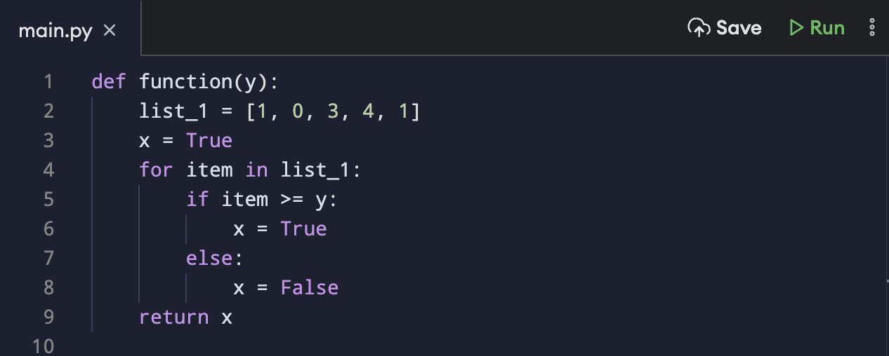

# Практические задачи - код

*Disclamer*: данные задачи встречались лично мне на собеседованиях в крупных IT-компаниях в разные годы. Также добавлены задачи из открытых источников компаний и литкода.

Цель данной секции - выяснить, насколько тестировщик вообще способен писать простой код и реализовывать несложные алгоритмы. 

Решение задач приведено на Kotlin, но в общем случае возможно переложить тот же алгоритм на привычный вам язык либо описать псевдокодом. Чаще всего требуется писать без использования встроенных функций. Код должен компилироваться и проходить тестирование на приведенных примерах.

  

### Ozon

Дан массив целых чисел.
Написать функцию, которая будет возвращать массив целых чисел без дубликатов.

`Input: [3, 2, 1, 1, 0, 4, 5, 2, 0]`

`Output: [3, 2, 1, 0, 4, 5]`

[Решение](tasks/ozonTask.kt)

### Тинькофф

#### Задача 1.
Дана строка и буква. Написать метод, который вернет число, сколько раз буква встречается в строке вне зависимости от регистра. 

`Input: “Hello”, “L”`

`Output: 2`

#### Решение

#### Задача 2. 
Дан массив целых чисел. Вывести медиану массива.
Медиана - среднее число в массиве с нечетным количеством элементов. 
Если количество четное - вывести среднее арифметическое двух средних чисел массива.

`Input: [1, 2, 3]`

`Output: 2`

`Input: [2, 3, 4, 5]`

`Output: 3,5`

#### Решение

#### Задача 3. 
Написать функцию, которая возвращает true, если поданный на вход массив содержит последовательность из трех или более чисел в любом месте. 

`Input: [1, 3, 4, 5]`

`Output: true`

`Input: [1, 1, 2, 4, 6, 7]`

`Output: false`

#### Решение

### Яндекс

#### Задача 1.

Дан массив целых чисел и еще число. Написать функцию, которая выводит сколько раз данное число встречается в массиве. Если не встретилось ни разу или массив пуст, вернуть 0.

`Input: [1, 2, 3, 4, 4, 5] и 4`

`Output: 2`

[Решение](tasks/yandexTask.kt)

### Avito

#### Задача 1.

Дана функция, что принимает входным параметром целое число Y, возвращает булевое значение. Что вернет функция, если входной параметр равен 1? При каких значениях Y вернется false?

#### Решение:

1. При y = 1 вернется true
2. В диапазоне значений y > 2 (внимание на последнее число заданного массива - только на него и нужно смотреть при решении данной задачи)

